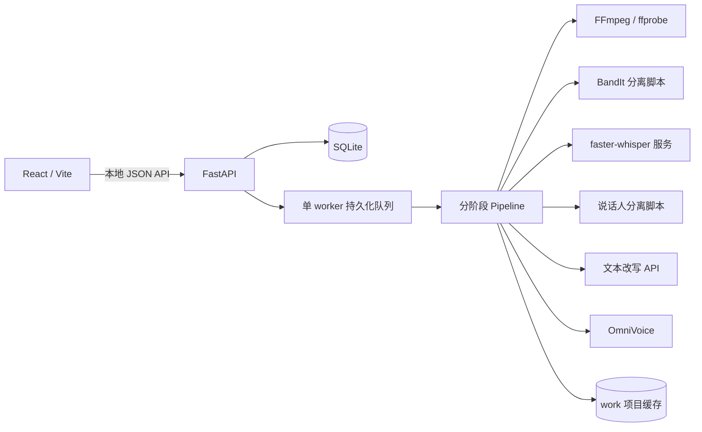

# 架构与代码结构

本文按当前源码说明程序边界和处理链路。它记录实现现状，不代表完整成片已经通过人工验收。

## 运行边界

工具在一台 Windows 电脑上运行：React 页面通过本地 HTTP API 控制 FastAPI 服务；SQLite 保存系列、项目、片段、角色、任务和异常；一个持久化单 worker 队列串行调用媒体处理与外部模型服务。视频源保持只读，项目缓存写入 `work/projects/{project_id}`。

## 代码目录

| 路径 | 职责 |
| --- | --- |
| `backend/app/__main__.py` | Python 模块入口；使用 Uvicorn 启动本地 API。 |
| `backend/app/main.py` | FastAPI 应用、请求校验、健康检查、项目/片段/角色/任务/媒体接口，以及前端静态文件挂载。 |
| `backend/app/pipeline.py` | 逐阶段执行、检查并恢复 checkpoint、记录异常、使下游缓存失效、更新处理状态。 |
| `backend/app/queue.py` | SQLite 驱动的单 worker 队列；支持取消、重试、进程重启后恢复排队，并以文件锁避免同一数据库启动多个 worker。 |
| `backend/app/db.py` | SQLite schema、连接和基本读写；任务与处理状态的持久化来源。 |
| `backend/app/config.py` | 本地配置加载；支持项目 `.env`、`DUBBING_ENV_FILE` 和进程环境变量。 |
| `backend/app/adapters/` | 外部服务和媒体适配器；隔离 HTTP 接口、模型命令、FFmpeg 操作与错误类型。 |
| `scripts/` | BandIt、pyannote Community-1、声纹和歌曲检测的独立模型运行脚本。 |
| `frontend/src/api.js` | 前端 API 封装、路径编码和统一错误解析。 |
| `frontend/src/views/`, `components/`, `hooks/` | 系列/项目、处理队列、异常、设置等页面与共享状态。 |
| `launcher/` | Windows 首次安装、令牌配置、启动和停止脚本。 |
| `tests/` | 后端 pytest 与前端 Vitest 用例。 |
| `docs/API_CONTRACT.md` | 前后端 JSON API、状态值及错误语义的接口约定。 |

## 一次任务的数据流

源码中的阶段顺序为：

`probe → separate → transcribe → diarize → characters → rewrite → synthesize → mix → subtitle → export`

| 阶段 | 当前实现 |
| --- | --- |
| `probe` | 用 ffprobe 检查本地源视频和时长，登记源文件 SHA-256。 |
| `separate` | 调用 BandIt 本地脚本或配置的命令，要求产生可验证的对白轨及背景轨；也有单独接口可导入分离轨。 |
| `transcribe` | 先在原混音上运行歌曲检测，将自动检测区间与手动区间合并；再把对白轨交给 faster-whisper，保存句级文本与时间戳。歌曲区间不做改写或配音。 |
| `diarize` | 调用配置的说话人分离器并将说话人区间分配给转写句；Community-1 模式下不静默回退到其他声纹模型。 |
| `characters` | 依据当前分组创建/复用系列角色记录，从分离对白中按时长选取最多两段互不重叠样本并尝试创建 OmniVoice 音色档案；这是时长筛选，不是样本清晰度的自动评测。跨集匹配依赖同一 embedding 模型下的声纹数据。 |
| `rewrite` | 按源/目标语言、L1–L5 档位、语速与目标时间预算调用文本 API；校验返回 JSON、片段 ID 和文本长度预算。 |
| `synthesize` | 按片段调用 OmniVoice；测量实际音频长度，过长时最多再请求两次压缩改写，仍放不进时间窗则阻断，不截断音频或强行变速。 |
| `mix` | 把生成对白按时间偏移组合，再与分离背景混合；歌曲时间窗从原始混音恢复。 |
| `subtitle` | 只从有目标文本的对白片段生成 SRT。 |
| `export` | 保留源视频画面，写入新混音音轨并烧录目标语言字幕，输出候选 MP4。 |

每个完整阶段成功后，项目 metadata 与 checkpoint 写入 SQLite；大文件和阶段 JSON 放在该项目的工作目录。服务错误、无效产物或异常会形成异常记录。改动片段文本/角色/语速时会使关联音频及下游产物失效，片段级重生成避免重跑此前无关阶段。

## 主要接口和依赖

- 前端只请求本地 `/api/*`。接口字段与状态请以 `API_CONTRACT.md` 为准；健康检查只表示依赖可探测，不能证明真实媒体任务成功。
- 媒体探测、抽音轨、混音、歌曲恢复和封装由系统 FFmpeg/ffprobe 命令完成。
- faster-whisper 通过 Speaches 兼容服务调用，默认地址为 `http://127.0.0.1:8001`。
- OmniVoice 默认地址为 `http://127.0.0.1:7861`，适配器检查 `/tts/ping`，并发现其 Gradio OpenAPI 以创建角色音色。
- 文本改写使用 OpenAI 兼容 API；先请求 Chat Completions，接口不支持时才尝试 Responses。密钥只由后端读取，不应写入前端或提交到 Git。
- BandIt 与说话人/歌曲模型可由独立 Python 运行时执行；模型权重和运行时不属于源码依赖。实际地址、命令和路径由本机配置决定。

## 自动质量门槛

- 源视频必须存在并含可用视频流；分离后必须得到可验证的对白轨和背景轨，不允许用原始混音伪装成背景轨。
- 歌曲检测运行时缺失会阻断处理；低置信歌曲检测产生告警。歌曲片段保留原音频，不生成改写台词或目标字幕。
- 说话人分组过度碎片化时会阻断：当前条件是簇数大于 8 且簇数/对白窗口数大于 0.5。没有有效说话人分段时也不能建角色。
- 模型/服务失败、配音音频缺失、无效文件、非法时间区间或残留未解决的阻断异常不会标记为成功。未解决的非阻断异常可使状态为 `completed_with_warnings`。
- 项目阶段 checkpoint 通过各阶段的最低有效性条件后才保留，例如必需文件、数据库记录、对白音频 SHA-256 和导出时长检查；这些条件不等于对每个媒体文件进行完整内容审查。重试会从可用阶段恢复。

这些门槛是程序检查，不代表对语义、声纹身份、分离残留、歌曲边界、字幕遮挡或音画观感做了完整主观评估。

## 已知验收边界

仓库 README 记录了候选成片，但不把它视为已通过人工验收的儿童观看版。完整验收仍需实际确认歌曲区间及原曲恢复、逐角色音色映射与试听、改写语义和等级、背景残留、字幕遮挡、配音时间与音量，并播放检查最终 MP4。不要把健康检查、模型状态、测试通过或“候选成片已生成”当成这些项目已经验收。
